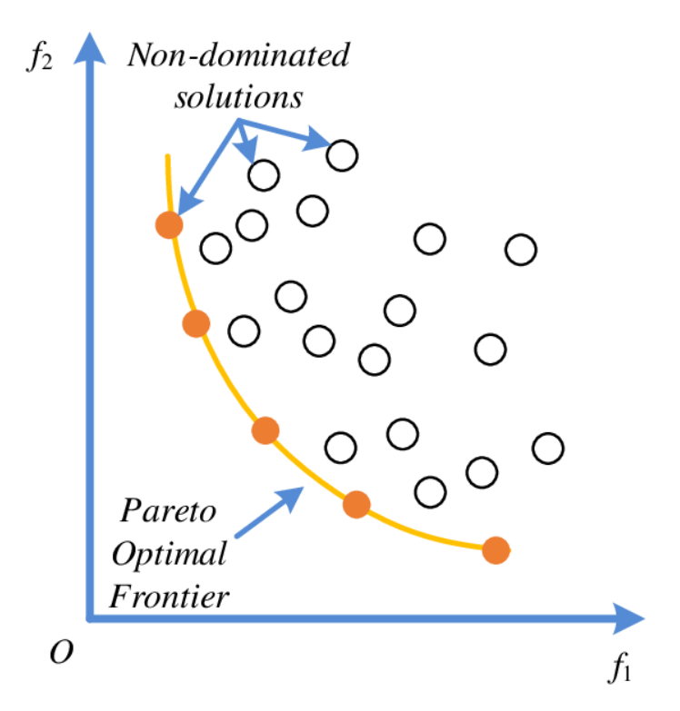
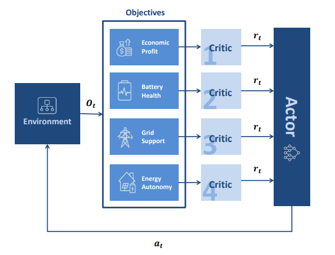
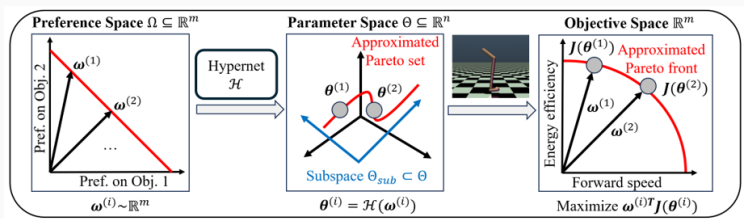
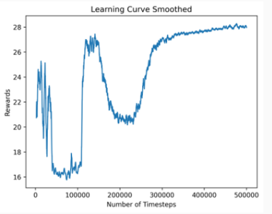
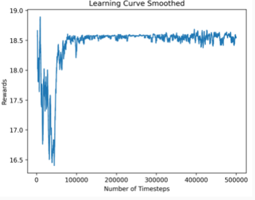
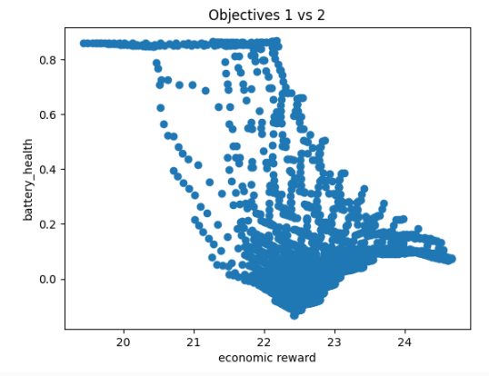
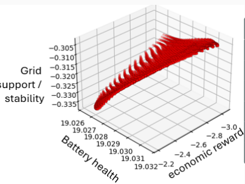
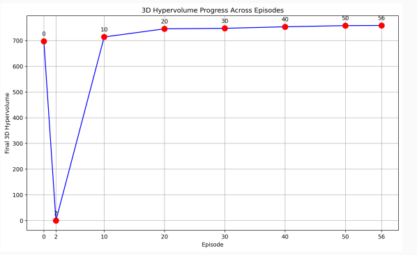
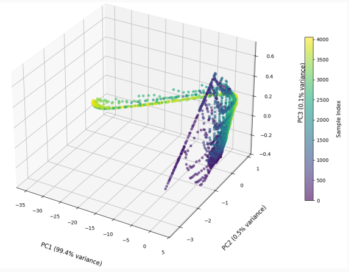

# EnergyNet Multi-Objective Reinforcement Learning (MORL)

An extension of the EnergyNet smart grid simulation framework that implements Multi-Objective Reinforcement Learning algorithms for Power Control System (PCS) optimization.

## Table of Contents

- [Overview](#overview)
- [Key Features](#key-features)
- [Multi-Objective Framework](#multi-objective-framework)
- [Algorithms](#algorithms)
- [Installation](#installation)
- [Usage](#usage)
- [Results](#results)
- [Project Structure](#project-structure)
- [Configuration](#configuration)
- [Further Work](#further-work)
- [References](#references)

## Overview

This project extends the original EnergyNet framework to support Multi-Objective Reinforcement Learning for Power Control System (PCS) agents.
Traditional RL optimizes a single scalar reward, but real-world energy systems involve multiple conflicting objectives. 
This implementation provides Pareto-optimal policies that allow operators to make real-time trade-offs between competing objectives.

### Problem Statement

The Power Control System faces multiple conflicting objectives:
- **Economic Profit**: Maximizing energy arbitrage profits
- **Battery Health**: Minimizing battery degradation and extending lifetime  
- **Grid Support**: Providing stability services to the electrical grid
- **Energy Autonomy**: Maintaining energy independence

Single-objective approaches cannot capture the complex trade-offs between these objectives. This project implements state-of-the-art MORL algorithms to learn a set of Pareto-optimal policies.

## Key Features

- **Multi-Objective SAC (MOSAC)**: Utility-based approach with multi-head critics
- **Hypernetwork-based MORL**: Approximates the entire Pareto front 
- **Pareto Front Visualization**: 2D/3D projections and PCA analysis
- **Baseline Comparisons**: Evaluation against standard RL algorithms
- **Flexible Scalarization**: Support for different preference weights

## Multi-Objective Framework

### Four Objectives

1. **Economic Profit** (`r₁`): Energy arbitrage revenue from buying low and selling high
2. **Battery Health** (`r₂`): Penalty for actions that degrade battery life
3. **Grid Support** (`r₃`): Rewards for providing grid stability services  
4. **Energy Autonomy** (`r₄`): Maintaining energy self-sufficiency

### Pareto Optimality

A policy π is Pareto optimal if no objective can be improved without degrading at least one other objective. The Pareto front represents all optimal trade-off solutions.



## Algorithms

### 1. Multi-Objective SAC (MOSAC)

**Architecture**: Extends Soft Actor-Critic with separate critics for each objective.

- **Multi-head Critics**: Four separate critic networks, one per objective
- **Vector Rewards**: Processes reward vectors instead of scalar rewards
- **Shared Actor**: Single policy network learns from all objectives
- **Scalarization**: Uses weighted linear scalarization for training



### 2. Hypernetwork-based MORL (Hyper-MORL)

**Architecture**: Uses a hypernetwork to approximate the entire Pareto front.

- **Hypernetwork**: Maps preference vectors ω ∈ Ω to policy parameters θ ∈ Θ  
- **Preference Conditioning**: Policy conditioned on user preferences
- **Pareto Set Learning**: Approximates the continuous Pareto front



## Installation

### Prerequisites

- Python 3.8+
- EnergyNet framework
- PyTorch
- Stable-Baselines3

### Setup

```bash
# Clone the repository
git clone https://github.com/your-repo/energy-net-morl.git
cd energy-net-morl

# Install dependencies
pip install -e .

# Install EnergyNet (if not already installed)
pip install -e ../energy-net
```

## Usage

### Training MOSAC

```bash
# Train MOSAC with shared critics
python MORL_modules/run_algos/train_mosac.py \
    --total-timesteps 500000\
    --learning-rate 3e-4 \
    --calc-mse-before-scalarization\
    --share-features

or run 
python MORL_modules/run_algos_scripts/run_mosac_4_objectives.py   

# Train MOSAC with separate critics  
python  MORL_modules/run_algos/train_mosac.py \
    --total-timesteps 500000\
    --learning-rate 3e-4 \
    --calc-mse-before-scalarization\
    --no-share-features
```
other python script can be found in MORL_modules/run_algos/scripts 


### Training Hyper-MORL

```bash
# Train Hypernetwork-based MORL
python MORL_modules/run_algos/run_ppo_psl.py
```

### Evaluation and Visualization

```bash
```

## Results

### Algorithm Performance Comparison

| Algorithm | Original Reward | Economic + Battery | All Objectives |
|-----------|----------------|-------------------|---------------|
| SAC | 23.10 | 11.25 | 16.22 |
| PPO | 26.92 | 12.48 | 14.30 |  
| TD3 | 34.63 | 19.40 | 6.58 |
| **MOSAC (Shared)** | -- | -- | **28.00** |
| **MOSAC (Separate)** | -- | -- | **18.50** |

*Values represent mean rewards over 3 random seeds.*

### MOSAC Results

#### Shared Critics Variant
- **Convergence**: After 500,000 steps
- **Final Performance**: 28 scalarized reward
- **Advantage**: Higher performance through shared feature learning



#### Separate Critics Variant  
- **Convergence**: After 100,000 steps (faster)
- **Final Performance**: 18.5 scalarized reward
- **Advantage**: More stable but lower final performance



### Hyper-MORL Results

- **Convergence**: After 100,000 steps
- **3D Hypervolume**: 758.65
- **Pareto Front**: Successfully approximated in 4D objective space


*Pareto front projection on economic reward vs battery health*

  
*3D projection of Pareto front (first three objectives)*


*3D hypervolume convergence over training episodes*

### Principal Component Analysis

PCA analysis reveals the relationships between objectives:

| Component | PC1 | PC2 | PC3 | PC4 |
|-----------|-----|-----|-----|-----|
| **Explained Variance** | 0.9945 | 0.0050 | 0.0006 | 0.0000 |
| Economic Reward | -0.0576 | 0.9683 | 0.2431 | 0.0000 |
| Battery Health | -0.0009 | -0.2436 | 0.9699 | 0.0000 |  
| Grid Support | 0.9983 | 0.0557 | 0.0149 | 0.0000 |
| Autonomy | 0.0000 | 0.0000 | 0.0000 | 1.0000 |

**Key Findings**:
- Most conflicting objectives: Battery Health vs Economic Reward
- Most influential in Pareto front: Grid Support, Economic Reward, Battery Health



## Project Structure

```
energy-net-morl/
├── algorithms/
│   ├── mosac.py              # Multi-Objective SAC implementation
│   ├── hypermorl.py          # Hypernetwork-based MORL  
│   └── baseline_wrapper.py   # Scalarization wrapper for baselines
├── environments/
│   ├── mo_energy_env.py      # Multi-objective environment wrapper
│   └── objectives.py         # Objective function definitions
├── training/
│   ├── train_mosac.py        # MOSAC training script
│   ├── train_hypermorl.py    # Hyper-MORL training script
│   └── train_baselines.py    # Baseline training script  
├── evaluation/
│   ├── evaluate_morl.py      # Model evaluation
│   ├── plot_pareto_front.py  # Pareto front visualization
│   └── metrics.py            # MORL evaluation metrics
├── configs/
│   ├── mosac_config.yaml     # MOSAC hyperparameters
│   └── hypermorl_config.yaml # Hyper-MORL hyperparameters
├── assets/                   # Plots and figures
└── README.md
```

## Configuration

### Environment Configuration

The multi-objective environment can be configured with different settings:

```yaml
# mo_env_config.yaml
objectives:
  - economic_profit
  - battery_health  
  - grid_support
  - energy_autonomy

weights:
  economic_profit: 0.4
  battery_health: 0.3
  grid_support: 0.2  
  energy_autonomy: 0.1

scalarization_method: "linear"  # linear, chebyshev, weighted_sum
```

### Algorithm Configuration

```yaml
# mosac_config.yaml
algorithm: "MOSAC"
network_type: "shared"  # shared, separate
learning_rate: 3e-4
gamma: 0.99
buffer_size: 1000
batch_size: 64
train_freq: 1
total_timesteps: 500000
```

## Further Work

### Planned Algorithms

1. **Pareto Set Learning (PSL)**: Alternative hypernetwork approach with parameter fusion
2. **Multi-Policy MORL**: Learning discrete set of Pareto-optimal policies  
3. **Preference-Based Methods**: Interactive optimization with human feedback

### Current Limitations

- **Consumption/Production Actions**: Current agents don't effectively utilize buy/sell actions
- **Convergence Guarantees**: No formal convergence proof for Hyper-MORL
- **Scalability**: Limited testing with higher-dimensional objective spaces

### Improvements

- Integration with full ISO+PCS multi-agent environment
- Dynamic preference elicitation during deployment
- Robust evaluation metrics for MORL algorithms
- Real-world validation with grid operators

## References

1. Shu, T., Shang, K., Gong, C., Nan, Y., and Ishibuchi, H. (2023). Learning Pareto Set for Multi-Objective Continuous Robot Control. Department of Computer Science and Engineering, Southern University of Science and Technology.

2. Liu, E., Wu, Y.-C., Huang, X., Gao, C., Wang, R.-J., Xue, K., and Qian, C. (2025). Pareto Set Learning for Multi-Objective Reinforcement Learning. National Key Laboratory for Novel Software Technology, Nanjing University.

3. Original EnergyNet Framework: [https://github.com/CLAIR-LAB-TECHNION/energy-net](https://github.com/CLAIR-LAB-TECHNION/energy-net)

## License

This project extends the EnergyNet framework and follows the same licensing terms.
